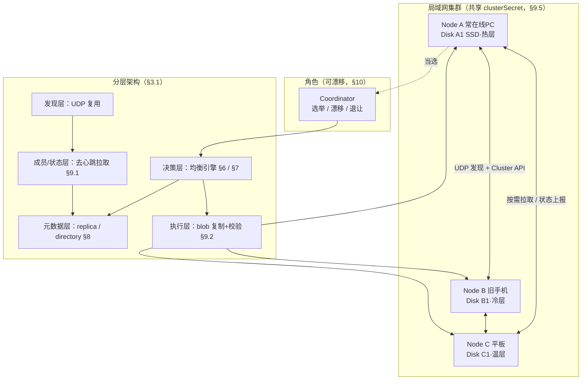

> 本文档从 `immich-android-server` 迁移至 `immich-go-server` 仓库，作为 Go 实现的分布式存储均衡设计蓝本。

# 多服务器存储均衡设计文档

> 状态：**设计草案（Draft）**，尚未实现，不涉及任何代码改动。
> 关联文档：`discovery-protocol.md`（服务发现）、`storage-structure.md`（单机存储结构）、`client-server-comm.md`。

## 1. 背景与目标

当前 Immich Android Server 为单机架构：文件保存在本机 `Documents/Immich/uploads/YYYY/MM/`，元数据存本机 SQLite。多台设备（手机、平板、旧机、PC）已能通过 UDP 发现协议互相发现，但彼此的存储相互独立，没有协同。

本设计引入 **多服务器存储均衡（Distributed Storage Balancing）**，把局域网内多台服务器组成一个协作集群，实现以下目标：

| 编号 | 需求 | 设计目标 |
|------|------|----------|
| R1 | **空间分配** | 在线时长最长的磁盘尽量腾空（作为"热层/缓存层"），在线时长短的磁盘承载久远/冷数据 |
| R2 | **文件迁移** | 高访问频率的文件迁移到高在线率服务器，低频文件下沉到低在线率服务器 |
| R3 | **副本保证** | 任意文件在集群中至少保留 **2 个副本**，且不在同一物理磁盘 |
| R4 | **磁盘在线时长统计** | 由**挂载磁盘的服务器本地自行统计**（自管自的、不互相更新），负载均衡时各节点各自上报 |

### 1.1 设计原则

| 原则 | 说明 |
|------|------|
| 最终一致 | 局域网内设备频繁上下线，采用最终一致性而非强一致 |
| 去中心优先 | 不强依赖单一主节点；协调者角色可选举、可漂移 |
| 本地自治 | 每个节点独立掌握本机磁盘真实状态，元数据可重建 |
| 数据安全第一 | 副本数不足时，宁可牺牲均衡也要先补副本；迁移必须"先复制后删除" |
| 复用现有机制 | 复用现有 `serverId` / `serverToken` / HMAC 签名 / UDP 发现 |

---

## 2. 核心概念

| 概念 | 定义 |
|------|------|
| **Node（节点）** | 一个运行中的服务器实例，由 `serverId`（UUID）唯一标识 |
| **Disk（磁盘）** | 一块物理存储介质，由**磁盘序列号 `diskSerial`** 唯一标识；一个节点可挂载多块磁盘 |
| **Asset（资产）** | 一张照片/一段视频，由 `assetId`（UUID）唯一标识 |
| **Replica（副本）** | 某个 asset 在某块磁盘上的一份物理拷贝 |
| **Coordinator（协调者）** | 负责运行均衡决策的节点；由集群选举产生，可漂移 |
| **Cluster（集群）** | 共享同一 `clusterSecret` 的一组节点 |

### 2.1 为什么用磁盘序列号而不是节点 ID

- 磁盘可在不同节点间**物理拔插迁移**（如 SD 卡、移动硬盘），序列号跟着磁盘走，节点 ID 不行。
- 同一节点可能挂载多块磁盘，需分别统计。
- "在线时长"本质是**磁盘的可用时长**，而非进程的可用时长，因此以 `diskSerial` 为统计主键最准确。
- 节点重装/换机后，只要磁盘还在，历史在线统计与副本归属不丢失。

---

## 3. 系统架构

```
┌───────────────────────────────────────────────────────────────┐
│                        LAN 集群                                 │
│                                                               │
│   ┌─────────────┐     ┌─────────────┐     ┌─────────────┐     │
│   │  Node A     │     │  Node B     │     │  Node C     │     │
│   │ (常在线PC)  │     │ (旧手机)    │     │ (平板)      │     │
│   │             │     │             │     │             │     │
│   │ Disk A1 ●●● │     │ Disk B1 ●   │     │ Disk C1 ●●  │     │
│   │ (SSD 高在线)│     │ (低在线)    │     │ (中在线)    │     │
│   └──────┬──────┘     └──────┬──────┘     └──────┬──────┘     │
│          │                   │                   │            │
│          └───────────────────┼───────────────────┘            │
│                              │                                 │
│                Pull(按需拉取) + Cluster API (HTTP)             │
│                   UDP 发现（复用现有协议）                     │
│                              │                                 │
│                      ┌───────┴────────┐                        │
│                      │  Coordinator   │ (选举产生，本例=Node A) │
│                      │  均衡决策引擎  │                        │
│                      └────────────────┘                        │
└───────────────────────────────────────────────────────────────┘
```

### 3.1 分层

| 层 | 职责 |
|----|------|
| **发现层** | 复用现有 UDP 发现（`discovery-protocol.md`），扩展节点为"集群成员" |
| **成员/状态层** | 去心跳化：UDP 发现维护成员关系；按需拉取各节点状态，拉取可达性即在线判断 |
| **元数据层** | 分布式资产目录：每个 asset 有哪些副本、在哪些磁盘上、访问热度 |
| **决策层** | Coordinator 上运行的均衡引擎（空间分配 R1、迁移 R2、副本 R3） |
| **执行层** | 节点间文件复制/删除（HTTP 拉取 + 校验 + 确认） |

### 3.2 整体架构图（mermaid）



> 图中箭头含义：实线双向=节点间通信；虚线=角色归属；单向实线=决策/数据流。磁盘以 `diskSerial` 跨节点标识，拔插后由认领流程（§11.3）重新归属。

---

## 4. 磁盘在线时长管理（R4）

### 4.1 磁盘身份

每块磁盘首次被节点挂载时，生成一条磁盘记录：

| 字段 | 说明 |
|------|------|
| `diskSerial` | 磁盘序列号（主键，跨节点唯一） |
| `label` | 用户可读标签（如"客厅PC-SSD"） |
| `capacityBytes` | 磁盘总容量 |
| `mountedNodeId` | 当前挂载它的节点 `serverId`（可变） |

> **获取序列号**：Android 需读取块设备信息（受权限限制，回退方案见 §11）；JVM 可用 `wmic`/`lsblk`/`diskutil`；不可得时用 `文件系统 UUID` 或落盘的 `disk-id` 文件兜底（详见 §11.2）。

### 4.2 在线时长统计模型（本地自治）

磁盘在线时长是**本地自治**的：哪台服务器挂载了某块磁盘，就由那台服务器程序自己统计并累加，集群中的其他服务器**不负责更新他人的磁盘时长**，节点之间也**不互相改写**这个值。

计时与结算完全在本机完成：

- **挂载 / 启动**：服务器程序检测到磁盘可读写，开始计时。
- **运行中**：持续累加该磁盘的在线秒数（存于本机 `disk` 表）。
- **卸载 / 关机 / 休眠**：停止计时并结算当前累计值。
- **重新挂载（含迁移到新节点）**：从磁盘上的 `.immich-disk-stats` 持久化值继续累加，**不归零**（文件格式见 §11.4）。

```
// 本机服务器程序只对「本机挂载的磁盘」自行累加
if 磁盘当前可读写:
    onlineSeconds += (now - lastTickAt)
    lastTickAt = now
```

> 关键点：累加动作只发生在**挂载该磁盘的那台服务器**上。其它节点无需、也不会修改这个值；它们只会在负载均衡时收到该磁盘的最新累计值（见 §4.3）。

派生指标：

| 指标 | 公式 | 用途 |
|------|------|------|
| **累计在线时长** `onlineSeconds` | 本机计时累加 | 长期可靠性排名 |
| **在线率** `uptimeRatio` | `onlineSeconds / (now - firstSeenAt)` | R1/R2 的核心排序依据 |
| **近期在线率** `recentUptime` | 滑动窗口（如近 7 天）内在线率 | 反映"最近是否常开机" |
| **在线评分** `onlineScore` | `0.7×recentUptime + 0.3×uptimeRatio` | 综合排序，兼顾近期与长期 |

### 4.3 上报与聚合（各自上报，互不更新）

- 在线时长由**本机自治维护**，不做节点间互相更新。
- 负载均衡决策时，每个节点**上报本机所有磁盘**的当前统计：`{diskSerial, onlineSeconds, firstSeenAt, capacityBytes, freeBytes, mountedNodeId}`（其中 `onlineSeconds` 为本机自管的**当前累计值**，非增量）。
- Coordinator（或每个节点本地）**读取并聚合**这些上报值，形成全局 `disk_stats` 视图用于排序 / 分层；聚合是只读的"汇总"，**不会回写、也不会修改任何节点的本地统计**。
- 磁盘物理迁移到新节点时，`mountedNodeId` 更新，但 `diskSerial` 与历史 `onlineSeconds` 随磁盘延续（由 §11.4 的 `.immich-disk-stats` 落盘值承载，不再依赖旧节点上报）。
- 冲突合并规则：同一 `diskSerial` 被多个来源上报时（如迁移瞬间双节点可见），取 `onlineSeconds` 较大者、`mountedNodeId` 取上报最新者——这只是聚合时的取舍，**不改写任何本地值**。

**全局 `disk_stats` 聚合算法**（Coordinator 在每次决策前执行，纯只读）：

```
disk_stats = {}                              -- 仅存在于 Coordinator 内存
for 每个可见节点 n 的上报 payload:
    for 每条上报磁盘 d in n.disks:
        if d.diskSerial 不在 disk_stats:
            disk_stats[d.diskSerial] = d        -- 首见，直接采用
        else:
            exist = disk_stats[d.diskSerial]
            merged.onlineSeconds  = max(exist.onlineSeconds, d.onlineSeconds)
            merged.mountedNodeId  = (d.lastSeenAt > exist.lastSeenAt) ? d.mountedNodeId : exist.mountedNodeId
            merged.freeBytes      = d.freeBytes  -- 以最新上报者为准（更准）
            merged.capacityBytes  = d.capacityBytes
            merged.firstSeenAt    = min(exist.firstSeenAt, d.firstSeenAt)
disk_stats 据此重算 onlineScore / tier（见 §4.2、§5.1），用于 R1/R2/R3 排序
```

- 聚合结果**只存在 Coordinator 内存**，不回写任何节点的 `disk` 表；节点本地 `disk.online_seconds` 仍以本机自管值为准。
- 节点掉线后上报过期：超过 `OFFLINE_SUSPECT_DAYS` 未再上报的磁盘，在聚合视图中标记 `suspect=true`，参与排序时降权（避免把数据调度到长期离线磁盘）。

---

## 5. 存储分层与空间分配（R1）

### 5.1 磁盘分层

按 `onlineScore` 对所有磁盘排序，划分为三层（阈值可配置）：

| 层 | 条件 | 定位 | 空间策略 |
|----|------|------|----------|
| **热层 Hot** | `onlineScore ≥ 0.8` | 常在线，作为主副本/缓存 | **尽量腾空**，只放热点文件 + 主副本，保留高水位空闲 |
| **温层 Warm** | `0.4 ≤ onlineScore < 0.8` | 中等在线 | 常规副本 |
| **冷层 Cold** | `onlineScore < 0.4` | 很少在线 | **承载久远/冷文件**，作为归档副本 |

> R1 的核心："在线时长最多的磁盘空间空出来" = 热层保持高空闲水位；"在线时间少的保存更久远的文件" = 冷文件下沉到冷层。

### 5.2 空闲水位目标

| 层 | 目标空闲率 | 说明 |
|----|-----------|------|
| Hot | ≥ 40% | 预留给新上传和热点回迁 |
| Warm | ≥ 20% | 常规缓冲 |
| Cold | ≥ 5% | 尽量填满，最大化归档容量 |

当某磁盘空闲率低于目标时，触发**下沉迁移**（把该磁盘上最冷的文件迁到更冷的层）。

> **软目标 vs 硬预留**：上表是"平衡决策的期望水位"（软目标），用于指导迁移方向；与之独立的是 **§5.5 磁盘硬预留（Hard Reserve Floor）**——每块盘无论层级，**绝不允许被写到低于该硬底线**。硬底线是安全红线，软目标只是优化偏好；冲突时硬底线优先（例如 Cold 软目标 5%，但硬底线 10%，则 Cold 实际最低保留 10% 空闲，无法追求到 95% 填满）。

### 5.3 文件冷热与"久远"定义

用 `assetTemperature` 综合评估，越低越冷、越该下沉：

```
assetTemperature =
      w1 × recencyScore     // 文件时间：file_created_at 越新越热
    + w2 × accessScore      // 访问热度：见 §6.1
    + w3 × favoriteBoost    // is_favorite / 相册命中 加权
```

- "久远的文件" ≈ `file_created_at` 很旧且 `accessScore` 低 → 低温 → 下沉冷层。
- 默认权重：`w1=0.4, w2=0.5, w3=0.1`（可配置）。
- 该温度是目录级迁移决策的输入；实际迁移以**目录**为单元、且默认仅对**上个月**目录执行（见 §6）。

### 5.4 空间管理闭环（写时分配 / 水位触发 / 刷新 / 满盘 / 回填）

§5.1–5.3 定义了"分层"与"水位目标"，但要让空间真正被管好，还需补齐以下闭环动作：

**(a) `free_bytes` 刷新时机**
- 节点在每次文件**写入成功**与**物理删除**后，立即用 `statfs` 刷新本机各 `disk.free_bytes`（写前仅做乐观预留，写后校正）。
- 周期性（每 `PULL_INTERVAL`）再校正一次，防止盘上其它进程写入导致偏差。
- 上报 payload 中的 `freeBytes` 以此为准（§9.1）。

**(b) 写时磁盘分配（新上传落到哪块盘）**
上传节点在本机按以下顺序选盘（§12.1 第 2 步）：

```
候选 = 本机所有在线、且 写入后空闲 ≥ 硬底线(§5.5) 的磁盘
     （即 freeBytes - 文件size ≥ max(capacity×DISK_MIN_FREE_RATIO, DISK_MIN_FREE_BYTES)）
按 tier 优先级 + 写入后水位余量排序：
  1) 优先 Hot 层（主副本默认热层），且写入后剩余空闲率须 ≥ HOT_FREE_TARGET
  2) 否则 Warm 层（写入后 ≥ WARM_FREE_TARGET）
  3) 否则 Cold 层（最后兜底，但仍须满足硬底线）
若候选为空 → 该节点返回 507 Storage Full，客户端可重试其它在线节点
```

- 写入只是"乐观占用"：先扣减预留额，失败则回滚预留，不污染 `free_bytes`。

**(c) 水位越限的实时触发（反应式迁移）**
- §6.4 月度评估只覆盖"上个月"目录；但磁盘可能在月中就被写满。因此增加**反应式触发**：
  - Coordinator 每次聚合 `disk_stats`（§4.3）后，检查每块盘的 `freeBytes/capacity` 是否低于其层目标（§5.2）。
  - 低于目标 → 立即对该盘生成**紧急下沉计划**：从该盘选 `temperature` 最低、优先非当月目录（紧急时也可含当月），做 §6.3 空间预检后迁移到更冷层。
  - 紧急计划与月度计划共用 `MIGRATION_BYTES_PER_CYCLE` 配额，但**优先级高于**常规均衡。

**(d) 删除后的冷层回填**
- 回收站过期、物理删除释放空间后，Cold 层空闲率可能上升（Cold 目标是尽量填满 ~95%）。
- Coordinator 在周期评估中若发现 Cold 层空闲率明显高于目标，可将温层中"够冷"的目录下沉到冷层，维持归档填充度（与 (c) 共用下沉逻辑，方向相反意图：填满冷层）。

**(e) 副本与空间的口径**
- `free_bytes` 为磁盘物理剩余；副本与原文件一视同仁占用空间，水位与预检均基于物理剩余，无需区分副本/主本。

### 5.5 磁盘硬预留（Hard Reserve Floor）

为防止"任何一块盘被写到太满"导致写失败、文件系统性能劣化或无法承载突发写入，引入**全局硬预留底线**，对每一块盘（不分层级）强制生效：

| 配置 | 默认 | 说明 |
|------|------|------|
| `DISK_MIN_FREE_RATIO` | 10% | 每块盘保留的最小空闲**比例**（硬底线） |
| `DISK_MIN_FREE_BYTES` | 10 GiB | 保留的**绝对字节数**（与比例取 **max**，防止小盘比例够但绝对值过小） |

**强制规则（所有写路径共用）**：
- 任何写操作（新上传主副本、补副本、迁移复制）落盘前，必须保证**写入后剩余空闲 ≥ `max(capacity×DISK_MIN_FREE_RATIO, DISK_MIN_FREE_BYTES)`**。
- 不满足 → 该写操作**被拒绝 / 改选其它盘**，绝不越过硬底线（即使软目标允许更满）。
- 硬底线独立于 §5.2 的层软目标：Hot/Warm 本就高于底线自然满足；Cold 软目标 5% 低于底线 10%，此时以 10% 为准。

**与现有逻辑的衔接**：
- 写时分配（§5.4(b)）：候选盘除满足层软目标外，还须满足硬底线；Cold 兜底时也检查底线。
- 空间预检（§6.3）：`required` 在 `dirSize×(1+SAFETY_MARGIN)` 基础上，再额外预留硬底线空间，复制后空闲不低于底线。
- 副本选择（§7.2）：排除条件增加"写入后空闲 < 硬底线"。
- 水位触发（§5.4(c)）：硬底线是比软目标更严格的预警线；任意盘逼近硬底线即触发紧急下沉，不必等到跌破软目标。

---

## 6. 文件迁移（R2）

### 6.0 迁移单元：以目录为单位

- 迁移的**最小决策与执行单元是"目录"**，而非单个文件。目录即 `storage-structure.md` 中定义的月份目录 `uploads/YYYY/MM/`。
- 决策结果二选一：**整目录迁移** 或 **整目录不迁移**；目录下所有文件随目录一起搬走，不存在"目录内部分文件迁移"。
- 理由：
  - 与现有月份目录结构天然契合，无需额外分组逻辑。
  - 整目录搬运便于校验、回滚与副本一致性（整目录副本要么都在、要么都不在）。
  - 降低决策与任务调度开销（以月为粒度，目录数量可控）。

### 6.1 访问热度采集（目录级聚合）

保留文件级访问事件采集，但**目录温度**由其包含文件的温度聚合得到：

| 指标 | 说明 |
|------|------|
| `accessCount` | 目录内各文件累计访问次数之和 |
| `lastAccessAt` | 目录内最近一次访问时间 |
| `accessScore` | 目录内各文件 `accessScore` 之和（或均值，可配置） |

> 文件级采集仍在本机随访问记录，随状态拉取/批量上报汇总，避免每次访问都写全局。

### 6.2 迁移范围：只对"上个月"目录

- 默认迁移窗口 = **上个月**的月份目录。例如当前为 2026-07，则仅评估 `2026/06/`。
- 当月目录（`2026/07/`）视为"活跃数据"，**不迁移**，留在热/温层保证访问速度。
- 更早的目录（早于上个月）通常已处于最终归档位置（冷层），不再频繁重评估；仅在层级错配或空间告警时按需纳入。
- 每月初触发一次"上个月目录"的均衡评估（周期可配置）。
- 评估时直接查 `directory` 表（§8.5）取该目录的 `tier` / `temperature` / `total_bytes`，**不遍历目录内文件**。

### 6.3 迁移前空间预检（硬约束）

迁移决策**生成前**必须先校验目标磁盘容量，确保整目录放得下：

```
对每个候选目标磁盘 D：
    required = 源目录总字节数 × (1 + SAFETY_MARGIN)   // 含碎片/增长余量
    floor    = max(D.capacity × DISK_MIN_FREE_RATIO, DISK_MIN_FREE_BYTES)  // 硬预留(§5.5)
    if D.freeBytes >= required + floor:   // 复制后空闲仍 ≥ 硬底线
        D 进入可用目标列表
    else:
        跳过 D（空间不足或会突破硬预留）
if 无可用目标: 放弃本次迁移，下周期重试 / 触发空间告警
```

| 参数 | 默认 | 说明 |
|------|------|------|
| `SAFETY_MARGIN` | 10% | 预留碎片/增长余量 |
| 目录总大小 | 实时统计 | 目录内**待迁出那份**副本的字节之和（避免重复计入多副本） |

> 空间预检是**硬约束**：宁可少迁、不迁，也不让目标磁盘写满。

### 6.4 迁移决策（整目录上迁 / 下沉）

Coordinator 在每月初（或配置周期）对"上个月"目录执行：

```
1. 从 `directory` 表（§8.5）取出候选目录的 `tier` / `temperature` / `total_bytes`（O(目录数)，不扫描文件）
2. 下沉：目录温度低（久远+少访问）且位于热/温层 → 计划下沉到更冷的层
3. 上迁：目录温度高（被大量回看）且主副本在冷层 → 计划上迁到热层
4. 对每条计划先做 §6.3 空间预检，筛掉空间不足的目标
5. 生成 MigrationPlan[]（整目录粒度），按收益排序，受配额限制（见 §6.6）
```

**决策评分公式**（步骤 2/3 判定方向与 §6.6 收益排序共用）：

- 目录"应处层"由 `temperature` 决定：`temp < COLD_TEMP_THR`(0.4) → 冷层；`temp ≥ HOT_TEMP_THR`(0.8) → 热层；否则温层。
- 若目录当前 `tier` 已等于应处层 → **不迁移**（直接跳过）。
- 迁移收益 `gain = |tier_rank(应处层) − tier_rank(当前层)| × total_bytes`，其中 `tier_rank`：热=3、温=2、冷=1。`gain` 越大越优先。
- 下沉方向：当前层比应处层"更热"时下沉（如热→冷，`gain=2×total_bytes`）。
- 上迁方向：当前层比应处层"更冷"且 `accessScore` 近期上升时上迁（冷→热）。
- `MigrationPlan[]` 按 `gain` 降序排列；单周期内只取 `gain` 字节累计 ≤ `MIGRATION_BYTES_PER_CYCLE`（§14）的前若干条。

**目标磁盘选择**（对每条计划）：

```
目标层 = 应处层
候选 = 目标层内、通过 §6.3 空间预检、且当前在线的磁盘
if 候选非空:
    选 onlineScore 最高者（最可靠优先）
else:
    放宽到相邻层（热↔温、温↔冷）重新做空间预检筛选，仍无 → 放弃该计划并告警
注：不得选源目录所在 diskSerial（避免同盘搬移无意义）
```

### 6.5 迁移执行（先整目录复制后删除）

```
Coordinator                 SourceNode              TargetNode
   │  下发 MigrationTask(目录)  │                       │
   │──────────────────────────>│                       │
   │                            │  TargetNode 批量拉取   │
   │                            │<──────────────────────│  GET /cluster/blob/:assetId (逐文件)
   │                            │  流式 + 逐文件 checksum │
   │                            │──────────────────────>│
   │                            │                       │ 逐文件校验一致后写盘
   │                            │      目录整体写盘 + 注册副本 │
   │                            │<──────────────────────│  确认
   │  更新该目录所有文件副本元数据│                       │
   │<───────────────────────────────────────────────────│
   │  确认目录级有效副本数≥2 后  │                       │
   │───────────────────────────>│  删除源目录旧副本      │
```

**关键安全约束**：
- 整目录"复制 + 逐文件校验 + 更新元数据 + 删除源"，任一步失败则**整目录回滚**，源副本保留。
- 删除源副本前，必须确认该目录内每个 asset 的**有效副本数 ≥ 2**（见 R3）。
- 传输带校验和（复用 `asset.checksum`，为空则迁移时计算并回填）。
- 目录级原子性：以目录为回滚单位，避免"迁了一半"。

### 6.5.1 断点续传（大目录中途中断恢复）

§6.5 的"整目录复制"对大月份目录（数千文件、数百 GB）是一次性操作；一旦中途掉线或低电量/移动网络暂停（§6.6），若从头重来会浪费带宽、违背节流初衷。需支持**断点续传**。

**进度存哪（关键：Coordinator 无状态，§10）**：进度**不存 Coordinator**，而是落在**目标节点磁盘**上的临时清单 `.<dirKey>.migrating.json`（落于目标磁盘存储根）：

```json
{
  "taskId": "mig-2026-06-a1b2",
  "srcDisk": "WD-1234", "dstDisk": "SN-5678",
  "totalFiles": 5000, "totalBytes": 256000000000,
  "completed": ["asset-a1", "asset-a2"],
  "partial":  { "asset-video-x": { "bytesCopied": 734003200 } },
  "state": "IN_PROGRESS"
}
```

**任务状态机**：`PLANNED → IN_PROGRESS → (COPIED → VERIFIED) → DONE`；异常 `ROLLBACK / FAILED`。

**续传逻辑（目标节点自愈，Coordinator 仅按 `taskId` 重发）**：

```
目标节点读 .migrating.json 后恢复：
  for f in 源目录文件:
    if f in completed:        跳过（仅轻量重校验，确认本地未损坏）
    elif f in partial:        发 Range: bytes=<bytesCopied>- 续传该文件尾部并追加
    else:                     从头整文件拉取 + 逐文件 checksum 校验
  全部文件完成 → 比对整目录 checksum(§11 .immich-dir.json) → 注册副本 → 通知 Coordinator
```

**两种"半成品"处理**：

| 方式 | 适用 | 做法 |
|------|------|------|
| 整文件重拷（默认简单路径） | 文件不大 | partial 直接丢弃重来，靠 checksum 幂等 |
| 字节级续传（大文件） | 单文件 GB 级（视频） | 源节点支持 `Range` 请求，目标 append；整体拷完再算最终 checksum |

**与原子性/副本约束不冲突**：
- 源删除**仍只在**全部文件 `completed` 且有效副本数 ≥2 后发生（沿用 §6.5 硬约束）。
- partial 文件不计入副本数、不参加"副本达标"判定。
- 同一 `taskId` 幂等：即使 Coordinator 漂移/脑裂换人（§10.4），重发任务也只续传、不重复全量拷。

**失败收敛**：
- 续传重试超 `MIGRATION_MAX_RETRY` → 任务 `FAILED`；Coordinator 可改派目标盘，源副本保留。
- 低电量/移动网络暂停（§6.6）→ 仅暂停、**不断点**，恢复后从 `.migrating.json` 接着走。

### 6.5.2 完成判定与零丢失保证

**状态机终态**：`PLANNED → IN_PROGRESS → COPIED → VERIFIED → DONE`（异常 `ROLLBACK / FAILED`）。三个关键时点意义不同：

| 时点 | 含义 | 是否可视为"结束" |
|------|------|------------------|
| `COPIED` | 目标盘拉完所有文件，`.migrating.json` 的 `completed` 填满 | 否，尚未校验 |
| `VERIFIED` | 整目录 checksum 比对源 `.immich-dir.json` 一致，并在目标盘注册副本 | **数据已无丢失风险**（源盘此刻消失也不丢） |
| `DONE` | Coordinator 确认目录内每个 asset 有效副本数 ≥2 后删除源副本并确认 | **真正结束**（空间回收） |

> 结论：**"迁移结束"= `DONE`；"数据不再有丢失风险"= `VERIFIED`**。二者之间只差"删源"一步，且这一步前置了副本门槛。

**删源前置条件（硬约束）**：执行 `删除源副本` 前，必须满足
```
for each asset in 目录:
    有效副本数(含刚注册的 target 副本) ≥ MIN_REPLICAS(2)
其中"有效" = 副本所在磁盘当前可达 / 或 last_seen_at 在 OFFLINE_SUSPECT_DAYS 内（§7.2）
```
任一 asset 不满足 → 不删源、任务保持 `VERIFIED` 等待补副本或重试，绝不通融。

**零丢失四保险**（全部源自 §6.5 关键安全约束）：

| 保险 | 机制 |
|------|------|
| 先拷后删 | 任一步失败整目录回滚，源保留；不同时毁两份 |
| 副本数门槛 | 删源前每个 asset 有效副本 ≥2，绝不删"最后一份" |
| 校验兜底 | 逐文件 checksum + 目录级 `.immich-dir.json` 比对；损坏副本不计入"有效" |
| 断点续传 | 中断只暂停、进度留盘、源始终保留，大目录不掉半截 |

**回滚时的目标残留清理（补全 §6.5.1 未明写点）**：任务进入 `ROLLBACK/ FAILED` 时，除保留源外，**必须清理目标盘**的 `.<dirKey>.migrating.json` 与 `partial`/`completed` 的半成品文件，避免下次同目录任务遇到陈旧清单误判"已完成"。清理失败不阻塞回滚（源安全优先）。

**已知边界（非迁移逻辑职责）**：
- 删源进行中进程崩溃：目标盘 `VERIFIED` 副本已注册且完好，源可能残留部分旧文件；重扫时清理源残留即可，**无丢失**。
- 并发双盘物理损坏（源 + 另一副本盘同时失效）超出单笔迁移范畴，由 R3 + 周期健康检查（§7.2）兜底。

### 6.6 迁移节流

| 限制 | 目的 |
|------|------|
| 单节点并发迁移数上限 | 避免占满带宽/IO |
| 迁移仅在源和目标都在线时进行 | 保证可完成 |
| 低电量/移动网络时暂停（复用 `BatteryMonitor`） | 保护移动设备 |
| 每周期迁移字节配额 | 平滑负载 |
| 单目录大小上限（可选） | 超大目录拆批或跳过 |

---

## 7. 副本保证（R3）

### 7.1 副本策略

| 规则 | 说明 |
|------|------|
| **最小副本数** `MIN_REPLICAS = 2` | 每个未删除 asset 至少 2 份有效副本 |
| **反亲和** | 2 个副本不得在同一 `diskSerial` 上；尽量不在同一节点 |
| **层分布** | 理想：1 份在热/温层（快速访问）+ 1 份在冷层（归档兜底） |

### 7.2 副本健康检查与修复

Coordinator 周期扫描 `replica` 元数据：

```
for each asset (未删除):
    有效副本 = 副本所在磁盘当前可达/或最近在线
    if 有效副本数 < MIN_REPLICAS:
        标记 asset 为 UNDER_REPLICATED
        选择新目标磁盘（满足反亲和 + 有空间 + 在线）
        生成补副本任务（优先级高于均衡迁移）
```

**补副本目标磁盘选择算法**（满足 R3 反亲和与层分布）：

```
候选 = 所有 last_seen_at 在 OFFLINE_SUSPECT_DAYS 内（近期可见）的磁盘
排除：
  - 已持有该 asset 任一副本的 diskSerial（反亲和：同盘不重复）
  - freeBytes - asset.size < max(capacity×DISK_MIN_FREE_RATIO, DISK_MIN_FREE_BYTES)（空间不足或会突破硬预留 §5.5）
  - 若现有副本都在同一节点，则优先排除该节点（尽量跨节点）
按优先级打分选 1 块：
  1) 层分布加分：现有副本在热/温层时，冷层磁盘 +2 分（鼓励 1 热 + 1 冷）
  2) onlineScore 降序优先（高可靠磁盘放主副本）
  3) freeBytes 充裕者优先
取最高分磁盘；若无任何候选 → 标记 AT_RISK + 告警，等磁盘恢复/接入后重试
```

- **副本不足优先级最高**：先补副本，再谈均衡（R1/R2）。
- 某磁盘长期离线（超过阈值，如 30 天）→ 其上副本视为"可疑"，为相关 asset 预防性补副本。
- 删除文件：仅当用户删除 asset 时，才删除其**所有**副本（软删除 `is_trashed`，回收站过期后物理删除）。

### 7.3 副本状态机

```
        创建/上传
           │
           ▼
      ┌─────────┐  副本数达标   ┌──────────┐
      │ PENDING │─────────────>│  HEALTHY │
      └─────────┘              └────┬─────┘
                                    │ 磁盘离线/丢失
                                    ▼
                            ┌──────────────────┐  补副本完成
                            │ UNDER_REPLICATED │───────────┐
                            └────────┬─────────┘           │
                                     │                     ▼
                                     │ 无法补足        ┌──────────┐
                                     └───────────────>│ AT_RISK  │
                                                      └──────────┘
```

---

## 8. 数据模型（拟新增，SQLDelight）

> 与现有 `Asset.sq`、`ServerConfig.sq` 并列，新增以下表。**仅为设计示意，暂不建表。**

### 8.1 `disk`（磁盘登记与在线统计，R4）

```sql
CREATE TABLE disk (
    disk_serial TEXT PRIMARY KEY,       -- 磁盘序列号（跨节点唯一）
    label TEXT NOT NULL DEFAULT '',
    capacity_bytes INTEGER NOT NULL DEFAULT 0,
    free_bytes INTEGER NOT NULL DEFAULT 0,
    mounted_node_id TEXT,               -- 当前挂载节点 serverId
    online_seconds INTEGER NOT NULL DEFAULT 0,  -- 累计在线秒数
    first_seen_at INTEGER NOT NULL DEFAULT 0,
    last_seen_at INTEGER NOT NULL DEFAULT 0,         -- 最近被拉取/上报时间
    recent_uptime REAL NOT NULL DEFAULT 0,      -- 近 7 天在线率
    online_score REAL NOT NULL DEFAULT 0,       -- 综合在线评分
    tier TEXT NOT NULL DEFAULT 'WARM'           -- HOT / WARM / COLD
);
```

### 8.2 `node`（集群成员）

```sql
CREATE TABLE node (
    node_id TEXT PRIMARY KEY,           -- serverId
    node_name TEXT NOT NULL DEFAULT '',
    last_url TEXT,                      -- 最近已知 serverUrl
    last_seen_at INTEGER NOT NULL DEFAULT 0,
    is_coordinator INTEGER NOT NULL DEFAULT 0,
    battery_level INTEGER,             -- 供节流决策
    is_online INTEGER NOT NULL DEFAULT 0
);
```

### 8.3 `replica`（副本分布，R3 核心）

```sql
CREATE TABLE replica (
    id TEXT PRIMARY KEY,
    asset_id TEXT NOT NULL,             -- 关联 asset.id
    disk_serial TEXT NOT NULL,          -- 副本所在磁盘
    relative_path TEXT NOT NULL,        -- 磁盘内相对路径
    checksum TEXT,                      -- 副本校验和
    status TEXT NOT NULL DEFAULT 'PENDING', -- PENDING/HEALTHY/UNDER_REPLICATED/AT_RISK
    created_at INTEGER NOT NULL DEFAULT 0,
    verified_at INTEGER NOT NULL DEFAULT 0
);

CREATE UNIQUE INDEX idx_replica_asset_disk ON replica(asset_id, disk_serial); -- 反亲和：同盘不重复
CREATE INDEX idx_replica_asset ON replica(asset_id);
CREATE INDEX idx_replica_disk ON replica(disk_serial);
```

### 8.4 `asset_access`（访问热度，R2）

```sql
CREATE TABLE asset_access (
    asset_id TEXT PRIMARY KEY,
    access_count INTEGER NOT NULL DEFAULT 0,
    last_access_at INTEGER NOT NULL DEFAULT 0,
    access_score REAL NOT NULL DEFAULT 0,   -- 时间衰减热度
    temperature REAL NOT NULL DEFAULT 0     -- 综合冷热
);
```

> **对现有 `asset` 表的影响**：
> - `original_path`（单机绝对路径）语义弱化，改由 `replica` 表描述"文件在集群哪些磁盘上"。迁移期可保留 `original_path` 作为本机主副本的兼容字段。
> - 需**新增一列 `dir_key TEXT`**（形如 `"2026/06"`），标记该文件所属月份目录。作用：① 库内"某目录全部文件元信息" = `SELECT * FROM asset WHERE dir_key = ?`，无需为目录另行维护明细表；② 与磁盘上的 `.immich-dir.json`（见 §8.5.1）、`directory` 缓存表（§8.5）的 `dir_key` 三处对齐，互为校验与重建依据。
> - 现状提醒：`checksum` 当前上传后为 `null`（见前序分析），需在上载时补算 SHA-256，否则 `replica.checksum`、`.immich-dir.json` 的校验值与 §6.5 迁移校验均无据可依。

### 8.5 `directory`（目录缓存，R2 加速）

为让每月均衡评估从"遍历文件"降为"查目录"，缓存每个月份目录的聚合视图。键为 `YYYY/MM` 形式的相对目录路径。

```sql
CREATE TABLE directory (
    dir_key TEXT PRIMARY KEY,            -- 形如 "2026/06"（相对 uploads 的路径）
    node_id TEXT NOT NULL,               -- 该目录当前主副本所在节点
    disk_serial TEXT NOT NULL,           -- 该目录当前所在磁盘
    tier TEXT NOT NULL DEFAULT 'WARM',  -- 当前所在层 HOT/WARM/COLD
    asset_count INTEGER NOT NULL DEFAULT 0,   -- 目录内文件数
    total_bytes INTEGER NOT NULL DEFAULT 0,   -- 目录内"待迁出那份"副本字节和
    access_score REAL NOT NULL DEFAULT 0,     -- 目录级访问热度（§6.1）
    temperature REAL NOT NULL DEFAULT 0,      -- 目录温度（§6.1）
    last_eval_at INTEGER NOT NULL DEFAULT 0,  -- 最近一次评估时间
    updated_at INTEGER NOT NULL DEFAULT 0
);

CREATE INDEX idx_directory_tier ON directory(tier);
CREATE INDEX idx_directory_disk ON directory(disk_serial);
```

| 字段 | 评估用途 |
|------|----------|
| `tier` | 直接判断是否需要上迁/下沉，无需先看文件 |
| `temperature` | 排序/分层决策的输入（§6.4） |
| `total_bytes` | 迁移前空间预检（§6.3）直接取值，不必实时遍历 |
| `asset_count` / `access_score` | 监控与阈值判断 |

**维护时机**：
- 新文件写入 / 删除时，增量更新对应目录行（`asset_count`、`total_bytes`）。
- 访问热度汇总（§6.1）落地时刷新 `access_score` / `temperature`。
- Coordinator 每月初评估前，可先 `SELECT * FROM directory WHERE dir_key = 'YYYY/MM'`，O(目录数) 完成决策，不再扫描文件。

> 该表本是**派生缓存**，可从 `asset` / `replica` / `asset_access` 重建；按 §8.6 设计升格为**跨节点共享的控制面放置图**，经 `/state` 拉取聚合并持久化到本机库，单节点下线不丢失，是全局均衡决策的关键输入。

### 8.5.1 磁盘级目录清单 `.immich-dir.json`（随盘自描述，R3 辅助）

`directory` 表是**集群级聚合缓存**（存在 Coordinator/节点 DB，给均衡决策用）。与之互补，应在**每个磁盘的月份目录**中放一份自描述清单，记录本目录**所有文件**的元信息，随磁盘走。

**位置**：`uploads/YYYY/MM/.immich-dir.json`（与 §11.2 `.immich-disk-id` 同思路，是"disk-id 认领"在目录级的延伸）。

**字段（每个文件一条）**：

| 字段 | 说明 |
|------|------|
| `assetId` | 对应 `asset.id` |
| `dirKey` | `"YYYY/MM"`，与 `asset.dir_key` 一致 |
| `checksum` | SHA-256（与 `replica.checksum` 同源，迁移校验用） |
| `size` | 文件字节数 |
| `type` | IMAGE / VIDEO |
| `mimeType` | MIME |
| `fileCreatedAt` | 文件创建时间 |
| `originalFileName` | 原始文件名 |
| `replicaOn` | 该文件在本磁盘之外的其它副本所在 `disk_serial` 列表（便于跨盘认领时核对副本分布） |

**价值**：
- **换节点即认领**：磁盘插到新节点，新节点扫 `.immich-dir.json` 即可完整认领本目录全部文件与副本，**不依赖全局 `asset` 表**（契合你之前定的"磁盘靠序列号/disk-id 认领、可拔插跨节点"）。
- **离线校验 / 迁移免扫盘**：迁移前空间预检（§6.3）、逐文件校验（§6.5）直接读清单，不必逐个读库或遍历目录物理扫描。
- **三处互校**：`asset.dir_key`（库内明细）、`directory`（聚合缓存）、`.immich-dir.json`（磁盘自描述）三者 `dir_key` 对齐，任一处丢失可从另两处重建。

**维护时机**：
- 文件写入 / 删除 / 迁移复制成功时，增量更新对应目录的 `.immich-dir.json`（写前取锁，避免并发损坏）。
- 与 `directory` 表区分：`.immich-dir.json` 是**明细**，随磁盘读写；`directory` 表是**聚合**，供 Coordinator 决策。两者通过 `dir_key` 关联，方向一致。

---

## 8.6 元数据可见性分层：控制面共享 vs 数据面本地

> 本节是对 §8.1–§8.5 数据模型的**可见性补充**：同样这些表，哪些需要在集群内**全局可见**、哪些只需**本机持有**。设计目标是用最小的跨节点共享数据量，消除"节点下线后无人知道该均衡"的盲点（见 §8.6.1）。
> 代码现状（immich-go-server 实现）：`GlobalRepo` 仅对 `disk` 做跨节点聚合（`ListDisks` 走 `AggregateDiskStats`），而 `ListDirectories` / `ListAssets` / `ListReplicas` 全部走**本机本地库**——即目前目录、资产、副本三类元数据都不跨节点可见。本节的改动即把"目录放置图"提升为跨节点共享，其余保持不变。

### 8.6.1 问题：当前元数据可见性盲点

按现状实现，副本元数据（`replica` 表）只登记在**持有那块盘的节点**本地，从不回传、不汇总：

- 链式迁移 `A→B→C` 后，`asset@DiskC` 只存在于 C 的库；A、B 对该副本一无所知。
- 更致命的是节点下线场景：B、C 同时离线时，它们库里的 `replica` 与 `directory` 记录随节点不可达而**从决策视野消失**。
- Coordinator 的补副本逻辑只看本地 `ReplicaCount`（`coordinator.go` 的 `RunBalancingCycle`），于是：
  - 对"存活节点本地恰好持有一份"的尾巴数据 → 能触发补副本（本地计数 `< MinReplicas`）；
  - 对"只活在 B、C 上"的数据 → A 的 `ListAssets` 里根本没有它，**既丢了也看不见该补**。
- 磁盘级（`disk`）因走 `/state` 聚合，B、C 下线后其盘在全局视图中仍可被 `graceOffline` 宽限后由存活节点认领（§11.3），但**目录级与文件级元数据没有同等机制**。

结论：需要让"足够做全局均衡决策"的元数据跨节点可见，但又不能把最庞大的文件级 `replica` 表全量广播。

### 8.6.2 原则：控制面共享、数据面本地

把元数据切成两层：

| 层 | 内容 | 跨节点可见性 | 量级 |
|----|------|--------------|------|
| **控制面（共享）** | `disk`（磁盘清单/分层/容量）+ `directory`（目录放置图：哪个目录在哪块盘、什么层/温度） | **全局共享 / 复制到每个节点** | 极小：磁盘 = O(盘数)；目录 = O(月份数)，远小于文件数 |
| **数据面（本地）** | `replica`（文件级副本分布）、`asset`、`asset_access`、blob 字节 | **仅本机持有，绝不复制** | 庞大：`replica` = O(文件数 × 副本数)，是真正的体量大头 |

- 共享数据量小、且是均衡/迁移决策的**全部所需输入**（Coordinator 要知道"有哪些目录、各落在哪块盘、所有磁盘的容量与层"——这些都在控制面）。
- 文件级 `replica` 留在本地：某节点只在自己要服务/修复该文件时才需要它，无需广播；复制它违背"共享数据少"的初衷。

### 8.6.3 控制面内容（disk + directory）

- **`disk`**：已在 §8.1 定义，且经 `/state` 上报 + `AggregateDiskStats` 聚合（§4.3），本就是控制面。无需额外改动。
- **`directory`（目录放置图）**：§8.5 定义的聚合视图，需从"本机缓存"升格为"跨节点共享放置图"。每个节点本地维护一份 **全局目录放置表**（下称 `directory_global`），内容为集群内**所有**月份目录的 `dir_key / node_id / disk_serial / tier / temperature / total_bytes / access_score / last_eval_at`。

### 8.6.4 数据面内容（replica + asset + blob）

- **`replica` / `asset` / `asset_access`**：严格本机持有。即使 B、C 离线，其 `replica` 记录也不必被其他节点复制——修复路径见 §8.6.7（靠磁盘认领 + 盘上 `.immich-dir.json` 重建，而非复制巨大索引）。
- **blob 字节**：永远只在物理盘上，随 `diskSerial` 走；跨节点只通过 §9.2 的 `GET /blob` 按需拉取。

### 8.6.5 目录放置图的共享机制（拉取聚合 + 持久化，与磁盘级一致）

复用 §4.3 磁盘的 `/state` 拉取聚合机制，使目录放置图成为**每个节点本地都持有的全量控制面**，而非 owner 单点上报：

```
1. 各节点 /state 响应携带本机 directory 表（§9.1 的 directories 数组）
2. Coordinator/各节点 Federate 时：
     - AggregateDirectoryStats(peers) 按 dir_key LWW 合并（last_eval_at 较大者胜，
       平票取 nodeId 较大者，§cluster.AggregateDirectoryStats）
     - 把合并结果 upsert 进本机 directory 表（SaveDirectory 的 LWW 写入）
3. 任一节点崩溃重启 / 周期评估时，本机 directory 表已是全集群目录放置图
```

关键点——**与"各自上报"的本质区别在持久化**：聚合结果写入本机库（`Node.Federate` 中 `store.SaveDirectory`），而非仅存于内存。因此 B、C 下线后，A 的本地 `directory` 表仍保留 `d1 → disk D-B(offline)` 记录 → Coordinator 在 A 上仍能看见"该目录位于已离线的盘"并据此决策。磁盘级聚合（§4.3）只在内存、不持久化，所以磁盘离线后会从视图消失；目录级刻意持久化以换取"离线仍可见"。

- `last_eval_at` 采用**纳秒级**时间戳（`time.Now().UnixNano()`），避免同秒连续写入被 LWW 误判为相等而跳过更新。
- 目录变化频率极低（每月初评估 + 迁移时更新），聚合/持久化开销可忽略。
- 因每个节点都持有全量目录放置图，B、C 离线不影响全局决策可见性。

### 8.6.6 节点下线后的行为（B、C 离线时）

| 数据 | B、C 离线后 A 是否可见 | 能否据此均衡 |
|------|------------------------|--------------|
| `disk`（D-B/D-C） | 可见（/state 聚合 + `graceOffline` 后可认领） | 能：标记离线、触发重宿主 |
| `directory`（d1 在 D-B） | **可见**（§8.6.5 复制全量） | 能：Coordinator 知"d1 需重宿主/再均衡" |
| `replica`（d1 内各文件副本分布） | **不可见**（数据面本地） | 不能直接发 `REPLICA` 任务修复 |
| `asset`（d1 内文件清单） | 不可见（数据面本地） | 同上 |

即：**共享目录放置图让"迁移/重宿主决策"全局正确；文件级副本修复仍受数据面本地限制**——这正是 §8.6.7 要补的闭环。

### 8.6.7 与 §11.3 磁盘认领 / §8.5.1 目录清单的衔接（修复盲点的闭环）

文件级修复的盲区靠**磁盘认领 + 盘上自描述清单**闭合，而非复制 `replica` 表：

- B、C 离线超 `graceOffline` 后，A 认领 D-B（§11.3）：扫描该盘每个月份目录的 `.immich-dir.json`（§8.5.1），**批量重建本地 `replica` / `asset` 索引**。
- 此时 A 的 `directory_global` 已知"d1 曾在 D-B"，认领后把 `d1.disk_serial` 更新为 A 本地盘、并复制该变更 → 目录放置图收敛。
- 重建出的 `replica` 若使某 asset 副本数 `< MinReplicas`，A 本地的 `CheckReplicas`（§7.2）即可正常下发补副本任务。

> 因此本设计是自洽的：**目录级共享负责"决策可见性"（小数据量），文件级修复靠"认领盘 + 扫盘上清单重建索引"（不复制大索引）**。二者配合，B、C 离线后既能正确决策、又能最终自愈，而跨节点共享的数据量始终维持在小头。

### 8.6.8 能解决 / 不能解决（边界）

**能解决**：
- 迁移/重宿主决策全局正确：任意存活节点都持有全量目录放置图，B、C 离线也能看见"哪些目录落在离线盘"并触发再均衡。
- 共享数据量小：`disk + directory` 远小于 `replica`，符合"共享数据少"。

**仍受限 / 需配合其它机制**：
- 纯"文件级副本修复"在 B、C 离线期间、且盘尚未被认领前，A 无法主动发起（因 `replica` 本地且 B、C 不可达）。该窗口由 §11.3 认领 + `.immich-dir.json` 重建兜底，属"恢复后自愈"而非"实时在线修复"。
- 若 B、C 的盘**永久丢失且未认领**（物理损毁），则其上独有的文件确为丢失——这超出副本修复范畴，由 R3 + 周期性健康检查（§7.2）在仍有其它副本时兜底。

### 8.6.9 对现有章节的改动点

- **§8.5 `directory` 表**：由"本机派生缓存"升格为"跨节点共享的控制面放置图"，经 `/state` 拉取聚合并**持久化到本机库**，单节点下线不丢失（见 §8.6.5）。
- **§9.1 `/state` payload**：新增 `directories` 数组（本节点 `directory` 全量），作为对端拉取聚合的源；全量经 `/state` 拉取聚合 + 持久化（§8.6.5），不依赖单点上报。
- **§4.3 聚合**：新增 `AggregateDirectoryStats` 按 dir_key 做 LWW 合并（last_eval_at 较大者胜）；聚合结果写入本机库，使目录放置图在节点离线后仍保留。
- **§16 代码衔接**：`Coordinator` 的 `ListDirectories` 读本机持久化后的 `directory` 表（已含全量）；`ListReplicas` / `ListAssets` 保持读本机（数据面）。
- **实现注**：采用与磁盘级一致的 `/state` 拉取聚合（而非独立 push 端点），目录行按 `dir_key` 唯一、带 `last_eval_at` 纳秒级 LWW；`RelinquishDirectory` 改为仅删本节点是 owner 的记录，避免误删对端最新放置。

---

## 9. 集群协议与 API

> 复用现有 `serverToken`/HMAC 做节点间鉴权；下列为集群内 HTTP 接口（拟新增 `/api/cluster/*`）。

### 9.1 成员与状态拉取（按需，去心跳）

| 接口 | 说明 |
|------|------|
| `GET /api/cluster/state` | **主要机制**：Coordinator 按需拉取各节点状态（节点信息 + 本机磁盘统计含 `onlineSeconds` 当前累计值 + 访问热度）；拉取不可达即判定该节点离线 |
| `POST /api/cluster/heartbeat`（可选） | 节点主动上报状态的备选机制（非必需），内容与上同 |

节点状态 payload 示意（状态拉取返回 / 主动上报内容）：

```json
{
  "nodeId": "550e8400-...",
  "nodeUrl": "http://192.168.1.21:2283/api",
  "batteryLevel": 78,
  "disks": [
    {"diskSerial": "WD-1234", "capacityBytes": 512000000000,
     "freeBytes": 300000000000, "onlineSeconds": 8640000, "firstSeenAt": 1770000000}
  ],
  "directories": [
    {"dirKey": "2026/06", "diskSerial": "WD-1234", "tier": "COLD",
     "temperature": 0.3, "totalBytes": 256000000000, "lastEvalAt": 1781050000}
  ],
  "accessDelta": [
    {"assetId": "a1", "accessCount": 3, "lastAccessAt": 1781050000}
  ],
  "signature": "hmac-sha256..."
}
```

> `directories` 为本节点 `directory` 表全量，作为对端 `/state` 拉取聚合的源；目录放置图经拉取聚合后**持久化到本机库**（§8.6.5），单节点下线仍保留，不依赖单点上报。

### 9.2 副本与迁移

| 接口 | 说明 |
|------|------|
| `GET /api/cluster/blob/:assetId` | 目标节点从源节点拉取文件字节（带 checksum 头） |
| `POST /api/cluster/replica/register` | 复制完成后登记新副本 |
| `POST /api/cluster/replica/verify` | 请求节点校验某副本 checksum |
| `DELETE /api/cluster/replica/:id` | 删除某副本（仅 Coordinator 在副本数达标后下发） |
| `POST /api/cluster/task` | Coordinator 下发迁移/补副本任务 |

### 9.3 发现层扩展

在现有 UDP 发现响应中增加集群字段（向后兼容，旧客户端忽略未知键）：

```json
{ "...现有字段...": "...", "clusterId": "home-cluster", "clusterRole": "coordinator" }
```

### 9.4 磁盘位置路由（diskSerial → node）

任意节点要读取落在某 `diskSerial` 上的副本时，需先知道该盘**当前挂在哪台节点**（拔插后 `mountedNodeId` 会变）。除依赖 Coordinator 内存聚合视图外，提供显式路由接口，使路由不必每次经 Coordinator：

| 接口 | 说明 |
|------|------|
| `GET /api/cluster/disk/:diskSerial/location` | 返回该盘当前归属节点：`{nodeId, nodeUrl, online}`，便于直接发起 blob 拉取（§9.2） |
| （或：在 `GET /api/cluster/state` 响应中附带 `diskLocations: {diskSerial → nodeId}` 映射） | 各节点本地缓存，拔插后下次拉取即更新 |

**路由解析流程**（节点 X 要取 `diskSerial=D` 上的副本）：

```
1. X 先查本地缓存的 diskLocations；命中且 online → 直接按 nodeUrl 发 GET /api/cluster/blob
2. 未命中 / 已离线 → 调 GET /api/cluster/disk/:diskSerial/location 实时解析
3. 仍不可达 → 走 Coordinator 聚合视图兜底，或标记该副本 suspect（§7.2）
```

- 该接口只读、幂等；返回的"当前可见归属"与 §4.3 聚合的 `mountedNodeId`（取最新上报者）保持一致。
- 价值：磁盘跨节点拔插后，blob 访问能**自动改道到新节点**；同时把 Coordinator 从"每次路由必经"降级为兜底，减少单点依赖。

### 9.5 集群 HMAC 鉴权细节

所有 `/api/cluster/*` 请求须带节点间签名，防止局域网内伪造节点/篡改状态。鉴权基于**集群共享密钥**而非单节点 `serverToken`（后者是每台节点自己的，无法让 A 验证 B）。

**密钥来源（clusterSecret）**：
- 集群首次组建时，由最先成立的节点生成 256-bit 随机 `clusterSecret`，随 UDP 发现握手下发给每个加入节点（受信任局域网内明文下发，或手动配对码）。
- 各节点本地持久化（keychain/加密存储），不当成全局元数据。
- 节点脱群超 `OFFLINE_SUSPECT_DAYS` 再回来需重新走握手领密钥（可能已轮换）。

**请求头（每个集群请求携带）**：

```
X-Cluster-NodeId:    550e8400-...        // 发送方节点
X-Cluster-Timestamp: 1781050000         // epoch 秒，防重放
X-Cluster-Nonce:     <随机16字节>         // 单次随机，防重放
X-Cluster-Sig:       <HMAC>              // 签名值
```

**签名算法（HMAC-SHA256）**：

```
canonical = METHOD + "\n" + PATH + "\n" + TIMESTAMP + "\n" + NONCE + "\n" + SHA256(BODY)
sig = HMAC-SHA256(clusterSecret, canonical)
```

- body 为 JSON 时先算 `SHA256(body)`，避免大 payload 重复序列化。
- §9.1 状态 payload 的 `signature` 字段即：`HMAC(clusterSecret, nodeId + timestamp + SHA256(jsonPayload))`。

**接收方验签（四道关）**：

```
1. 用本机 clusterSecret 对相同 canonical 重算 HMAC
2. 常数时间比较 sig（防时序侧信道）
3. 时间窗：|now - Timestamp| > MAX_CLOCK_SKEW(默认300s) → 拒
4. 防重放：Nonce 在 skew 窗口内进已见集合，重复 Nonce → 拒
```

**密钥轮换**：`POST /api/cluster/key/rotate` 协商新密钥后进入重叠窗口（旧+新都接受），待所有节点拉到新密钥再废旧旧密钥。

---

## 10. Coordinator 选举

选举原则：**最高在线评分优先**（`onlineScore` 最高且在线的节点当选，平票用 `serverId` 字典序）。Coordinator **无状态**：它不持久化任何全局数据，决策所需的全局视图每次都由各节点状态按需拉取后聚合得到，因此故障漂移不丢数据。

### 10.1 触发时机
- **集群首次组建**：有 ≥2 个节点互相发现后，立即触发一次选举。
- **Coordinator 失联**：任何节点按 §10.2 判定 Coordinator 不可达，且自身满足候选资格（§10.3）时，触发重选。
- **Coordinator 主动让贤**：当 Coordinator 自身 `onlineScore` 跌出可见成员前 2 名（如本机磁盘大量离线/关机），主动发起重选，避免长时间由低可靠节点主导。

### 10.2 故障检测与角色漂移
- 每个节点以固定周期 `PULL_INTERVAL`（默认 60s）向当前已知 Coordinator 发 `GET /api/cluster/state`（或被 Coordinator 反向拉取）。
- 连续 `COORD_TIMEOUT`（默认 3×PULL_INTERVAL）内**所有**尝试都不可达 → 判定 Coordinator 失联。
- 失联后进入"选举窗口"：各节点计算自身 `onlineScore` 在当前可见成员中的排名，仅当自身为**最高（或并列最高且 `serverId` 最小）**时，才自宣为 Coordinator 并广播 `clusterRole: coordinator`（写入 UDP 发现响应，§9.3）。
- 漂移是**最终一致**的：其他节点在下次发现/拉取中看到新 `clusterRole` 即更新本地认知，无需投票协议。

### 10.3 候选资格与首选
- 候选节点须同时满足：自身在线、至少持有 1 块可读写磁盘、最近一个周期内成功上报过状态。
- 首轮选举（集群组建）：取当前可见成员中 `onlineScore` 最高者；相等取 `serverId` 字典序最小者。
- 为避免"开机瞬间抖动"导致频繁易主，新当选者设 `COORD_GRACE`（默认 2×PULL_INTERVAL）冷静期，期间不触发让贤/重选。

### 10.4 脑裂处理（详见 §13）
- 网络分区导致两节点同时自宣 Coordinator 时，以 `onlineScore` 高者为准，低者**主动退让**（将自身 `clusterRole` 改为 `member`，丢弃未下发的决策）。
- 所有迁移/副本任务带 `coordinatorEpoch`（单调自增）+ 幂等 `taskId`，退让方已下发的任务若未被执行，由胜出方按 `taskId` 去重后重排，避免重复迁移。

### 10.5 降级模式（无 Coordinator）
- 当集群成员 ≤1，或选举窗口内无节点满足候选资格 → 进入降级：
  - 各节点**仅保证本机持有的 asset 副本数**（弱化的 R3）：若本机某 asset 仅 1 份且集群内无法补，标记 `AT_RISK` 并本地告警；
  - **暂停全局均衡**（迁移 R1/R2 停止），避免无协调者时重复/冲突决策；
  - 一旦 Coordinator 恢复或新节点加入满足候选，自动退出降级并补跑一次评估。

---

## 11. 磁盘序列号获取（各平台）

### 11.1 平台方案

| 平台 | 方案 |
|------|------|
| JVM/Desktop | `lsblk -o SERIAL`（Linux）、`diskutil info`（macOS）、`wmic diskdrive get serialnumber`（Windows） |
| Android | 受限；可尝试读取 `/sys/block/*/device/serial`，SD 卡用 `cid`；多数场景需回退 |
| iOS | 沙盒无法获取硬件序列号，使用回退方案 |

### 11.2 回退策略（获取不到真实序列号时）

按优先级：
1. 文件系统 UUID（`blkid` / mount 信息）。
2. 在该磁盘存储根写入 `.immich-disk-id` 文件，内含随机生成的稳定 UUID，作为逻辑"磁盘序列号"。
3. 该 disk-id 随磁盘物理迁移而延续（因为文件在磁盘上），满足 R4 的"跟随磁盘"语义。

**`.immich-disk-id` 文件格式**（JSON，落于磁盘存储根，如 `Documents/Immich/.immich-disk-id`）：

```json
{
  "diskId": "9f1c2e3a-4b5d-6e7f-8a9b-0c1d2e3f4a5b",
  "generatedAt": 1770000000000,
  "hostNodeId": "550e8400-...",
  "label": ""
}
```

- `diskId`：随机 UUID（v4），一次性生成后**不再更改**（除非磁盘格式化）。
- `hostNodeId`：首次生成该文件的节点 `serverId`，供排查；磁盘迁移到新节点时**不修改**（保留出处），节点侧仅更新 `disk.mounted_node_id`。
- 生成时机：节点首次挂载该磁盘且拿不到真实序列号时，先检查根目录是否已存在 `.immich-disk-id`，**存在则复用（认领），不存在才生成**。

> 逻辑 disk-id 的缺点：磁盘格式化会丢失（已知限制，见 §17）。

### 11.3 磁盘认领流程（跨节点拔插）

新节点挂载一块"已有数据"的磁盘时，按以下顺序认领，使本机 `disk` 表与全局元数据对齐：

```
1. 读磁盘根 .immich-disk-id（或硬件序列号）→ 得到 diskSerial
2. 若本机 disk 表无该 diskSerial：
     - 读 .immich-disk-stats（§11.4）得到持久化的 onlineSeconds / firstSeenAt / lastTickAt，
       作为本机 disk 记录初值继续累加（不从 0 起，也不依赖旧节点上报）
     - 扫描每个月份目录的 .immich-dir.json，批量登记 replica（含 checksum、size、replicaOn）
     - 重建 directory 表对应行（聚合自 .immich-dir.json）
3. 更新 disk.mounted_node_id = 本机 serverId
4. 向 Coordinator 上报认领结果（state 接口）；
   Coordinator 在聚合时按 §4.3 规则合并在线统计，不回写本机值
5. 认领完成后，该磁盘参与分层/副本/迁移决策
```

- 认领是**增量、可重入**的：重复挂载同一磁盘不会重复建表，仅刷新 `mounted_node_id` 与缺失的 replica。
- 若磁盘被两个节点短暂同时可见（迁移瞬间），以"先完成认领并上报者"为归属；另一方在收到 Coordinator 聚合视图后自动退让该磁盘的归属声明。

### 11.4 磁盘统计落盘（`.immich-disk-stats`）

为使磁盘的"可靠性履历"随盘迁移、不依赖旧节点或 Coordinator 记忆（§4.2、§4.3），把累计在线统计**持久化在磁盘本身**：

**文件格式**（JSON，落于磁盘存储根，如 `Documents/Immich/.immich-disk-stats`）：

```json
{
  "diskId": "9f1c2e3a-...",          // 与 .immich-disk-id 对应，便于关联
  "onlineSeconds": 8640000,          // 累计在线秒数（持久化值）
  "firstSeenAt": 1770000000,         // 首次被任意节点发现的 epoch 秒
  "lastTickAt": 1781050000,          // 上次结算时间戳，挂载后从此继续累加
  "updatedAt": 1781050000
}
```

**维护规则**：
- 挂载该磁盘的节点在每次计时结算（§4.2）后，将 `onlineSeconds` / `lastTickAt` / `firstSeenAt` 写回此文件；为降低写放大，按 `STATS_FLUSH_INTERVAL`（默认 60s）批量刷盘，而非每秒写。
- `firstSeenAt` 仅在首次生成时写入，之后**不变**（履历起点跟随磁盘）。
- 磁盘被拔下时，做最后一次刷盘，落定当前累计值。
- 拔下期间不计入在线（正确）；新节点挂载后从 `lastTickAt` 之后的实际可读时间继续累加。

**与 `.immich-disk-id` 的关系**：`disk-id` 只写一次、作为稳定身份；`disk-stats` 频繁更新、承载履历。两者分离避免每次更新履历都改写身份文件，也缩小格式化以外的意外损坏面。

**容错**：若 `disk-stats` 缺失/损坏，退化为"从 0 起 + 依赖 Coordinator 合并旧节点上报"（原 §4.3 行为），仅分层评分短期失真，不丢数据。

---

## 12. 端到端流程示例

### 12.1 新文件上传（含 507 退回重试）

```
客户端                节点 N                 Coordinator            目标节点 T
  │  POST /api/assets  │                                            │
  │───────────────────>│                                            │
  │                    │ ① 按 §5.4(b) 选盘：本机在线盘、写入后空闲   │
  │                    │     ≥ 硬底线(§5.5) 且 ≥ 层软目标           │
  │                    │   ├─ 命中 → 落盘主副本                      │
  │                    │   └─ 未命中(全满) → 返回 507 Storage Full   │
  │  507 ◀────────────│                                            │
  │                    │                                            │
  │ ② 选盘成功 → 写盘；成功即按 §5.4(a) 刷 free_bytes（写后校正）   │
  │ ③ 写 replica(status=PENDING)；返回 201 + assetId 给客户端       │
  │<──────────────────│                                            │
  │   201 OK           │                                            │
  │                    │ ④ 状态上报(或拉取)携带该新 asset           │
  │                    │─────────────────── GET /api/cluster/state ─>│
  │                    │                                            │ ⑤ 发现副本数=1 < MIN_REPLICAS
  │                    │                                            │    选反亲和目标盘(优先冷层,§7.2)
  │                    │ <── POST /api/cluster/task (补副本) ────────│
  │                    │────────── GET /api/cluster/blob/:assetId ──│──>│
  │                    │<──────── 流式字节 + checksum ──────────────│<──│
  │                    │ ⑥ 逐文件校验 → POST /replica/register      │
  │                    │────────────────── POST /replica/register ─>│
  │                    │                                            │ ⑦ 副本数=2 → status=HEALTHY
```

**507 退回与重试逻辑（节点 N 全盘写不下时）**：

```
1. N 选盘失败（本机所有在线盘写入后都会跌破硬底线 §5.5，或写入后空闲 < 层软目标）
   → 返回 507 Storage Full，body 附 { "reason": "no_disk_space", "nodeId": N }
2. 客户端从发现列表(§9.3)另选一个在线节点 M 重发上传；若 M 也 507，继续遍历其他在线节点
3. 若所有已知在线节点均 507：
   - 客户端本地暂存/排队，并周期重试（退避）
   - 同时：任一节点因 "全部盘逼近硬底线" 触发 §5.4(c) 反应式紧急下沉，腾出空间后重试多能成功
4. 重试为幂等：以 asset 内容哈希(clientHash) 去重，避免重复落盘产生孤儿文件
```

> 关键点：507 是**节点级**回退，不丢上传请求；配合反应式下沉(§5.4(c))形成"满了→腾挪→再写"的闭环。

### 12.2 上个月目录下沉（R1）

```
1. 每月初，Coordinator 圈定"上个月"目录（如 2026-07 月初评估 2026/06/）
2. 该目录温度低（久远且少访问）→ 判定为冷，应下沉
3. 先做空间预检：选一块冷层磁盘，确认其剩余空间 ≥ 整目录大小×(1+余量)
4. 整目录下沉到冷层（先复制后删源，保证过程中副本数≥2）
5. 热/温层腾出空间，冷层承载久远文件
```

### 12.3 热文件上迁（R2）

```
1. 某老照片被相册翻看，accessScore 上升 → 温度升高
2. 其主副本在冷层（离线概率高，访问慢）
3. Coordinator 计划上迁：在热层节点新增一份副本
4. 若总副本数超限，可回收冷层多余副本（但仍保持 ≥2）
```

---

## 13. 边界情况与冲突处理

### 13.1 场景处理表

| 场景 | 处理 |
|------|------|
| 唯一持有副本的磁盘离线，且无法补副本 | 标记 `AT_RISK`，告警用户；恢复在线后优先补副本 |
| 迁移中途源或目标掉线 | 任务超时回滚（§6.5.2）：源副本保留、清理目标残留；下周期按 `.migrating.json` 续传 |
| 两节点同时认为自己是 Coordinator（脑裂） | 以 `onlineScore` 高者为准，低者退让（§10.4）；操作带 `coordinatorEpoch`+幂等 `taskId` 去重，避免重复迁移 |
| 磁盘拔到新节点 | 新节点扫描 `.immich-disk-id` / 序列号，认领已有副本，更新 `mounted_node_id`（§11.3） |
| 同一 asset 元数据冲突 | 以 `updated_at` 较新者为准（LWW），副本集合取并集后按健康检查收敛 |
| 用户删除 asset | 软删除→回收站→过期后删除所有副本（幂等，崩溃可重跑） |
| 全集群仅 1 个节点/1 块磁盘 | 无法满足 R3，降级为单副本并告警（§10.5）；接入第二块磁盘后自动补副本 |
| 补副本目标盘在复制中途掉线 | 目标 partial 清理、该 asset 重新标记 `UNDER_REPLICATED`，下次选其它盘重试（§7.2） |
| Coordinator 在迁移进行中崩溃 | 目标 `.migrating.json` 续传、源保留；新 Coordinator 重发同 `taskId` 仅续传不重复全量（§6.5.1） |
| 两块盘同时离线且互为某 asset 仅有的两份副本 | 仍触发 `AT_RISK` + 预防性补副本（若有第三盘可落）；否则按单副本告警，恢复任一盘即收敛 |
| 磁盘写满到硬底线边界、新上传 507 | 反应式紧急下沉（§5.4(c)）腾空间，客户端按 §12.1 重试；不写越线 |
| 同一目录被两个 Coordinator epoch 同时迁移（脑裂期） | `coordinatorEpoch` 高者胜，低者任务作废；`taskId` 去重保证目录只被迁一次（§10.4） |
| 副本过度复制（>MIN_REPLICAS） | 健康检查（§7.2）回收多余份（优先删最冷层/最不可靠盘上的副本），收敛回目标数 |
| 节点时钟偏移致 HMAC 被拒 | `MAX_CLOCK_SKEW`（§9.5）内可恢复；长期偏移节点告警并要求校正时钟后重新握手领密钥 |
| 认领期间双节点短暂同时可见同一磁盘 | 先完成认领并上报者归属，另一方收到聚合视图后自动退让该盘归属声明（§11.3） |
| 网络分区导致 Coordinator 视野分裂 | 进入降级（§10.5）：各节点保本机副本、暂停全局均衡；分区恢复后合并视图、按 `taskId` 去重补跑 |

### 13.2 冲突处理原则小结

- **数据不丢优先于决策进度**：任何回滚/崩溃都保留源，副本数门槛（≥2）是删源唯一通行证。
- **幂等去重**：所有写操作以 `assetId`/`taskId`/`coordinatorEpoch` 去重，重复下发不产生孤儿或重复迁移。
- **最终一致可接受**：短时间副本数不足、视图分裂均允许，靠周期健康检查与重跑收敛，不强求强一致。
- **自动收敛**：过度复制、元数据冲突、归属争夺，最终都由健康检查/LWW/退让规则自动归位，无需人工介入。

---

## 14. 配置项（拟）

| 配置 | 默认 | 说明 |
|------|------|------|
| `MIN_REPLICAS` | 2 | 最小副本数 |
| `COORD_TIMEOUT` | 3×`PULL_INTERVAL` | Coordinator 连续不可达判定离线并重选 |
| `PULL_INTERVAL` | 60s | 状态拉取周期（§10.2 故障检测基准） |
| `COORD_GRACE` | 2×`PULL_INTERVAL` | 新当选者冷静期，期间不触发让贤/重选 |
| `HOT_SCORE_THRESHOLD` | 0.8 | 热层阈值（亦作 `HOT_TEMP_THR`，§6.4 上迁判定） |
| `COLD_SCORE_THRESHOLD` | 0.4 | 冷层阈值（亦作 `COLD_TEMP_THR`，§6.4 下沉判定） |
| `HOT_FREE_TARGET` | 40% | 热层目标空闲率 |
| `SAFETY_MARGIN` | 10% | 空间预检/补副本余量（§6.3、§7.2） |
| `DISK_MIN_FREE_RATIO` | 10% | 每块盘硬预留最小空闲比例（硬底线，§5.5） |
| `DISK_MIN_FREE_BYTES` | 10 GiB | 每块盘硬预留绝对字节（与比例取 max，§5.5） |
| `STATS_FLUSH_INTERVAL` | 60s | 磁盘统计落盘批刷新间隔（§11.4） |
| `MIGRATION_BYTES_PER_CYCLE` | 可配 | 每周期迁移配额（§6.4 收益排序上限） |
| `TEMP_WEIGHTS` | 0.4/0.5/0.1 | 温度权重 w1/w2/w3 |
| `OFFLINE_SUSPECT_DAYS` | 30 | 磁盘离线多久视为可疑/掉线降权 |
| `MAX_CLOCK_SKEW` | 300s | HMAC 时间窗容差，超出拒绝（§9.5） |
| `MIGRATION_MAX_RETRY` | 5 | 断点续传失败重试上限，超出任务 FAILED（§6.5.1） |

---

## 15. 实现路线图（分阶段）

### 阶段一：磁盘身份与在线统计（R4 基础）
- [ ] 磁盘序列号获取（各平台 + 回退 disk-id，§11.1/§11.2）
- [ ] `disk` 表 + 本机磁盘登记与在线时长累加（§4.1/§4.2）
- [ ] 磁盘统计本机自治维护（无需上报通道；决策时按需拉取，§4.3）
- [ ] 验收：`disk-id`/`disk-stats` 文件在磁盘根正确生成；拔盘再插累计时长不归零（§11.4）

### 阶段二：集群成员与元数据
- [ ] `node` / `replica` / `asset_access` 表（§8）
- [ ] `GET /api/cluster/state`（按需拉取）；可选轻量存活上报（§9.1）
- [ ] **目录放置图跨节点共享**：`directory` 经 `/state` 拉取聚合（`AggregateDirectoryStats` LWW）+ 持久化到本机库（控制面共享，§8.6.5）
- [ ] Coordinator 选举（§10）
- [ ] 验收：关掉当前 Coordinator，另一在线节点在 `COORD_TIMEOUT` 内自动当选并接管决策；`clusterSecret` 握手下发成功、HMAC 验签通过（§9.5）；**任一节点离线后，其余节点的 `directory_global` 仍含其目录放置记录，Coordinator 能正确决策重宿主**

### 阶段三：副本保证（R3，最高优先业务价值）
- [ ] 副本健康检查（§7.2）
- [ ] 补副本任务（复制 + 校验 + register，§9.2）
- [ ] 反亲和约束（不同 diskSerial，尽量跨节点，§7.1）
- [ ] 验收：人为让一块盘离线，相关 asset 在 `OFFLINE_SUSPECT_DAYS` 内被补到第二份且不在同盘；过度复制被回收收敛

### 阶段四：均衡与迁移（R1 + R2）
- [ ] 分层与空闲水位监控（§5.1/§5.2）
- [ ] 访问热度采集与目录温度计算（落 `directory` 表，§8.5/§6.1）
- [ ] 目录级迁移单元 + 仅"上个月"窗口（§6.2）
- [ ] 迁移前目标磁盘空间预检（§6.3）+ 硬预留底线（§5.5）
- [ ] 下沉/上迁决策引擎 + 节流（整目录粒度，§6.4/§6.6）
- [ ] 验收：注入一个"温度过高且落在冷层"的目录，月度评估后自动上迁；某热盘写满触发反应式下沉（§5.4(c)）；迁移全程源副本保留、完成后有效副本≥2

### 阶段五：健壮性
- [ ] 脑裂/掉线/回滚处理（§13）
- [ ] 磁盘物理迁移认领（§11.3）
- [ ] 迁移断点续传（§6.5.1）+ 完成判定与零丢失保证（§6.5.2）
- [ ] 监控面板（各磁盘层级/副本健康/迁移进度）
- [ ] 验收：迁移中杀掉目标节点进程，重启后从 `.migrating.json` 续传而非重头来；脑裂期内同目录不被重复迁移（`taskId` 去重）；全满时上传返回 507 且客户端换节点成功（§12.1）

---

## 16. 与现有代码的衔接点（供后续实现参考）

| 现有组件 | 衔接方式 |
|----------|----------|
| `DiscoveryProtocol` / `DiscoveryServer` | 扩展响应字段（`clusterId`/`clusterRole`），发现集群成员 |
| `ServerConfig.sq` / `ServerConfigService` | 存 `clusterId` / Coordinator 状态 |
| `HmacUtils` / `serverToken` | 复用做集群 API 鉴权（按需拉取 / 可选上报签名） |
| `PlatformFileStorage` | 增加"按磁盘/相对路径"读写、拉取 blob 能力 |
| `AssetRoutes` | 记录访问事件；上传后触发补副本 |
| `SyncRoutes`（当前 stub） | 可演进为集群元数据同步通道 |
| `BatteryMonitor` / `StorageMonitor` | 为迁移节流与空闲水位提供输入 |

### 16.1 建议接口签名（Go，immich-go-server）

> 以下为衔接点的函数级签名草案，便于实现阶段直接落地；错误返回省略 `error` 以聚焦语义。

**集群 API 层（§9）**

```go
// 状态拉取与发现
func (s *ClusterApi) GetState(w, r) StatePayload          // GET /api/cluster/state (§9.1)
func (s *ClusterApi) GetDiskLocation(diskSerial string) DiskLocation // GET /api/cluster/disk/:diskSerial/location (§9.4)
func (s *ClusterApi) GetBlob(w, r, assetId string)        // GET /api/cluster/blob/:assetId，支持 Range (§9.2/§6.5.1)
func (s *ClusterApi) RegisterReplica(assetId, diskSerial, checksum string) // POST /api/cluster/replica/register
func (s *ClusterApi) VerifyReplica(assetId, diskSerial string) bool        // POST /api/cluster/replica/verify
func (s *ClusterApi) DeleteReplica(replicaId string)                       // DELETE /api/cluster/replica/:id
func (s *ClusterApi) SubmitTask(task MigrationTask | ReplicaTask)          // POST /api/cluster/task (§9.2)

// 鉴权（§9.5）
func SignRequest(secret, method, path string, ts int64, nonce, body []byte) string // HMAC-SHA256
func VerifyRequest(secret string, headers XClusterHeaders, body []byte) bool       // 四道关
```

**节点本地能力（§4/§5/§11）**

```go
func (n *Node) SelectWriteDisk(size int64) (Disk, error)   // §5.4(b) 写时分配，全满返 ErrStorageFull(507)
func (n *Node) ClaimDisk(rootPath string) error            // §11.3 认领：读 disk-id/stats、扫 .immich-dir.json、建表
func (n *Node) FlushDiskStats(disk Disk)                   // §11.4 按 STATS_FLUSH_INTERVAL 落盘统计
func (n *Node) RefreshFreeBytes(disk Disk)                 // §5.4(a) 写/删后 statfs 校正 free_bytes
```

**Coordinator 决策（§6/§7/§10）**

```go
type Coordinator struct{ epoch int64 }

func (c *Coordinator) RunBalancingCycle()                  // 月度评估 + 反应式水位(§5.4(c)/§6.4)
func (c *Coordinator) AggregateDiskStats(reports []NodeReport) map[string]DiskStats // §4.3 只读聚合
func (c *Coordinator) PlanMigration(dir Directory) (MigrationPlan, error) // §6.4 含收益评分+目标盘
func (c *Coordinator) SelectReplicaTarget(asset Asset) (Disk, error)     // §7.2 反亲和+层分布打分
func (c *Coordinator) CheckReplicas() []ReplicaTask                       // §7.2 健康检查→补副本任务
func (c *Coordinator) Elect()                                            // §10 选举/漂移/退让
```

**磁盘自描述文件（§11.2/§11.4）**

```go
type DiskIdFile   struct { DiskId, GeneratedAt, HostNodeId, Label string }
type DiskStatsFile struct { DiskId string; OnlineSeconds, FirstSeenAt, LastTickAt, UpdatedAt int64 }
type DirManifest  struct { DirKey string; Files []FileEntry; Checksum string } // .immich-dir.json (§11)
```

> 与 `HmacUtils`/`serverToken` 衔接：集群鉴权改用 `clusterSecret`（§9.5），`serverToken` 仍用于单节点既有接口，两者并存不冲突。

---

## 17. 已知限制

- 逻辑 disk-id 在磁盘格式化后丢失。
- Android/iOS 获取真实硬件序列号受限，多依赖回退方案。
- 最终一致性下，副本数短时间可能不足（补副本有延迟）。
- 局域网带宽有限，大规模迁移需较长时间。
- 本设计聚焦局域网；跨公网 P2P 不在此范围。
- 元数据可见性已按 §8.6 分层：**目录放置图（控制面）跨节点复制**，消除了"节点离线后无人知道该均衡"的盲点；但文件级 `replica` 仍本机持有，纯在线修复在 B、C 离线且盘未认领前受限，需配合 §11.3 认领 + `.immich-dir.json` 重建兜底。
